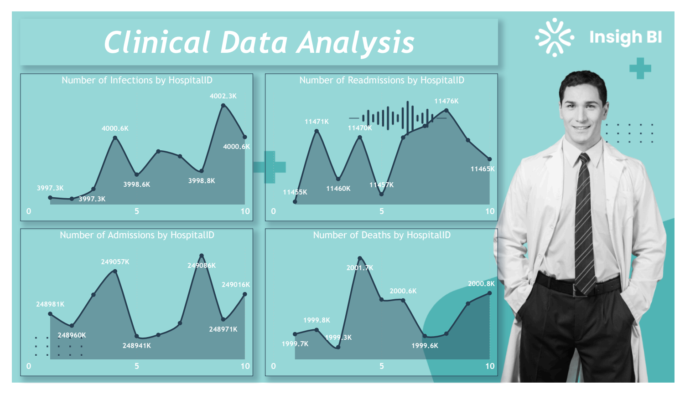
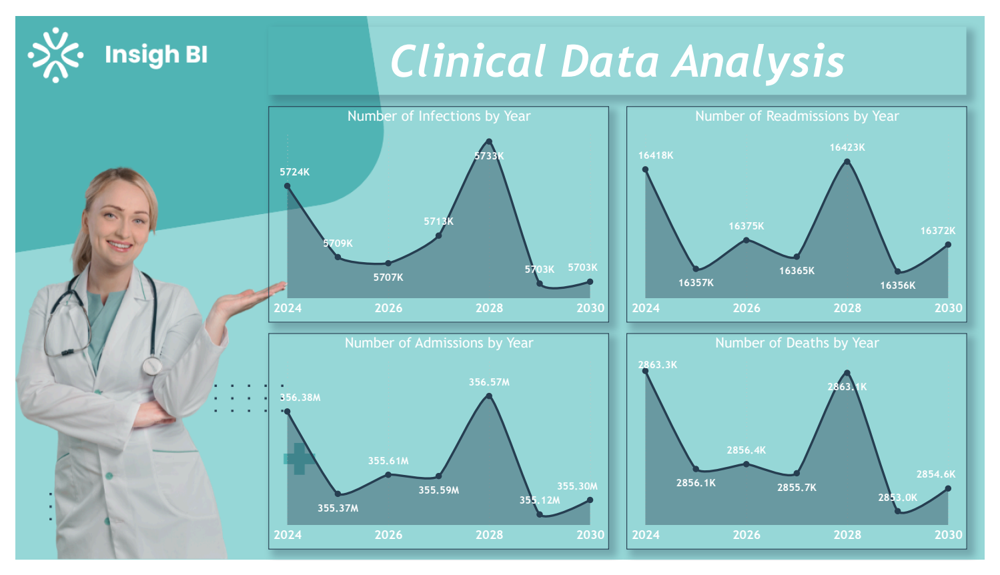

# HealthCare Data Analysis
Power BI | SQL Server | Data Analytics | Data Visualization

## Project Summary
End-to-end healthcare data analysis project focused on monitoring hospital performance metrics such as infections, readmissions, admissions, and deaths using a large-scale dataset stored in SQL Server and analyzed in Power BI.

The project enables trend analysis by hospital and by year to support data-driven insights into clinical outcomes and operational efficiency.

### Tools & Technologies
- Power BI Desktop & Power BI Service
- SQL Server (Data Source)
- SQL (Data Extraction & Validation)
- Power Query (ETL & Data Transformation)
- Data Modeling & Visualization

### Data Source
- SQL Server database: healthcare
- Table contains ~20M records
- Key fields include:
    - HospitalID
    - AdmissionDate
    - TotalAdmissions
    - Readmissions
    - Infections
    - TotalDeaths
    - AverageLengthOfStay

### Key Responsibilities
- Connected SQL Server to Power BI using custom SQL queries
- Validated and profiled large datasets using Power Query
- Ensured correct data types and handled data quality checks
- Designed multi-page Power BI reports
- Created line charts to analyze metrics by HospitalID and by Year
- Applied consistent report theming and layout design
- Published reports to Power BI Service

### Key Metrics & Analysis
- Number of infections
- Number of readmissions
- Total admissions
- Total deaths
- Year-over-year clinical trends
- Hospital-level performance comparison

## How to Use the Dashboard
- Use hospital and year filters to compare clinical performance
- Navigate between Hospital-Level and Year-Wise trend pages
- Hover over charts to view detailed metric values

## Report Screenshots (Power BI)

### Hospital-Level Analysis Dashboard

### Year-Wise Clinical Trends Dashboard

### Business Insights
- Identified hospitals with consistently higher infection and readmission counts
- Observed year-over-year fluctuations in admissions and deaths
- Enabled comparison of clinical performance across multiple hospitals
- Highlighted trends that can support healthcare quality improvement initiatives

### Outcome
Delivered a production-ready Power BI dashboard capable of handling large-scale healthcare data, enabling stakeholders to explore clinical metrics by hospital and by year.

### Skills Demonstrated
- Data Analysis & Visualization
- SQL & Relational Databases
- Large Dataset Handling
- Power BI Reporting
- Data Quality Validation
- Analytical Storytelling

## Data Ethics & Disclaimer
This project uses a synthetic or anonymized dataset for educational and analytical purposes only.  
It does not represent real patient data and should not be used for clinical or medical decision-making.
